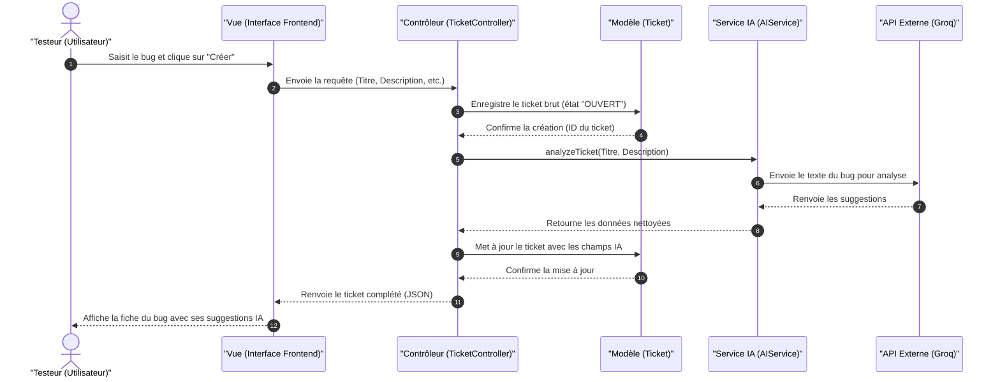

# 6.4.1 Diagramme de séquence « Analyse IA à la création d’un ticket » (Modèle MVC - Optimisé Draw.io)

Ce code Mermaid est optimisé pour être copié et collé directement dans **Draw.io** (via le menu `Insérer -> Avancé -> Mermaid`).

## Code Mermaid à copier

---

## Les Étapes Expliquées (MVC)

### 1. La Vue (Frontend)
* Le **Testeur** saisit les données du bug et valide. La **Vue** (l'interface utilisateur) s'occupe de capturer ces informations et d'envoyer la requête au contrôleur.

### 2. Le Contrôleur (`TicketController`)
* Le **Contrôleur** reçoit la requête, procède à sa validation et coordonne l'enregistrement du bug en sollicitant le modèle de données.
* Une fois le bug sauvegardé, il instancie le service d'analyse et lui envoie le titre et la description du ticket.

### 3. Le Modèle (`Ticket`)
* Représente la structure des données et s'occupe de leur persistance. Le **Modèle** enregistre d'abord le bug brut avec le statut `"OUVERT"`, puis il est mis à jour avec les informations obtenues par l'IA.

### 4. Le Service IA et l'API Externe (Groq)
* Le **Service IA** sert d'intermédiaire pour préparer le message, interroger l'**API Groq** externe, récupérer les prédictions (priorité, catégorie et solution suggérée) et vérifier que les réponses sont conformes aux attentes du projet avant de les renvoyer au contrôleur.

### 5. Retour et affichage
* Le **Contrôleur** met à jour le **Modèle** avec les suggestions IA validées.
* Le contrôleur renvoie le ticket final à la **Vue** qui le met en forme graphiquement pour l'utilisateur.
