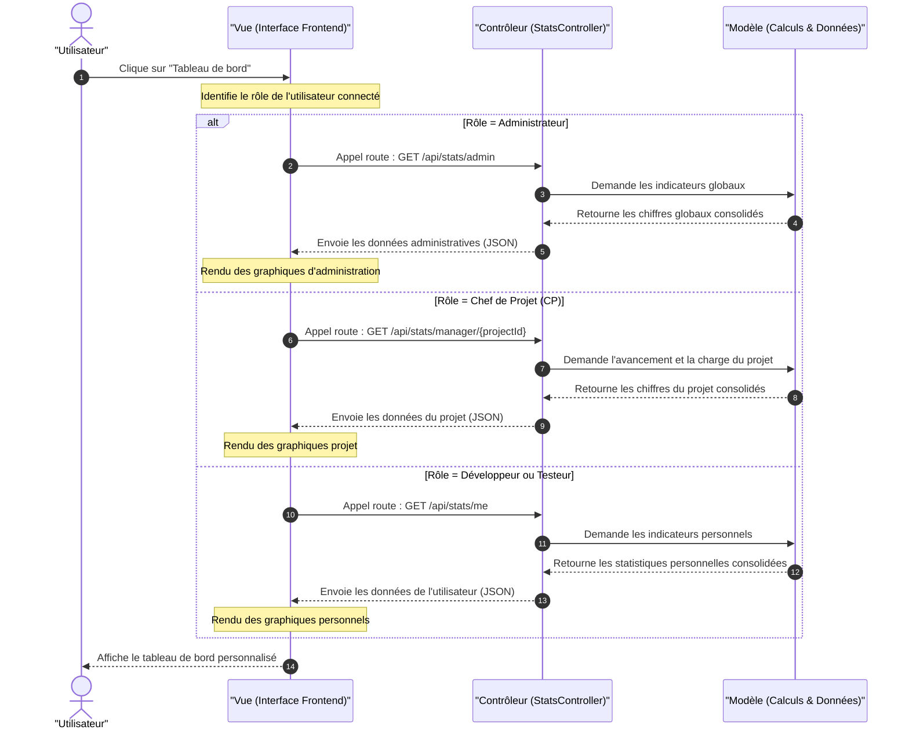

# 6.4.2 Diagramme de séquence « Consultation du tableau de bord » (Modèle MVC - Optimisé Draw.io)

Ce code Mermaid est optimisé pour être copié et collé directement dans **Draw.io** (via le menu `Insérer -> Avancé -> Mermaid`).

## Code Mermaid à copier

---

## Les Étapes Expliquées (MVC)

### 1. La Vue (Interface Frontend)
* L'**Utilisateur** clique sur le bouton "Tableau de bord".
* La **Vue** identifie son rôle et déclenche l'appel vers la route correspondante sur le contrôleur :
  * `GET /api/stats/admin` pour l'Administrateur.
  * `GET /api/stats/manager/{projectId}` pour le Chef de Projet.
  * `GET /api/stats/me` pour le Développeur ou le Testeur.

### 2. Le Contrôleur (`StatsController`)
* Le **Contrôleur** reçoit la requête de la Vue et orchestre la collecte des statistiques en sollicitant le **Modèle**.

### 3. Le Modèle
* Le **Modèle** se charge de traiter, de compter et de consolider les données nécessaires (ex. : taux de résolution des tickets, volume de tickets par priorité ou activité par développeur).
* Une fois les chiffres calculés, le **Modèle** renvoie les résultats au Contrôleur.

### 4. Rendu de la Vue
* Le **Contrôleur** retourne les statistiques formatées à la **Vue**.
* La **Vue** reçoit ces données et dessine dynamiquement les graphiques (diagrammes circulaires, courbes, barres d'avancement) pour les présenter à l'**Utilisateur**.
